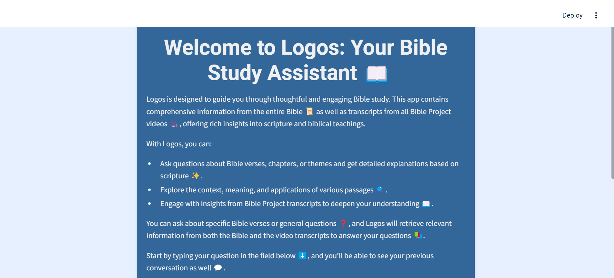
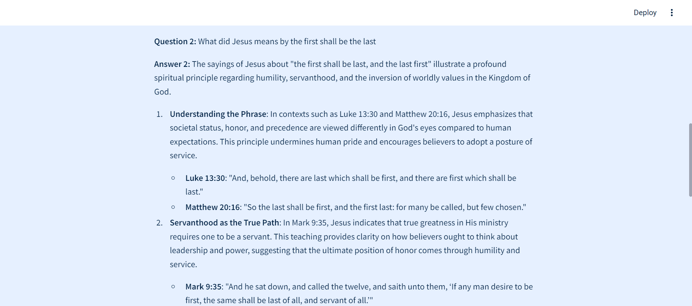

# 📖 **Logos: Your Ultimate Bible Study Companion**

Hey there! 👋 Welcome to **Logos**, your go-to AI-powered Bible study assistant. Whether you're diving into scripture for the first time or looking for deeper insights, Logos has your back. This tool brings together the power of AI and **The Bible Project** YouTube channel to give you rich, scripture-based responses to any question you have. It's all about helping you explore the Bible with context, meaning, and purpose. ✨

<div style="text-align: center;">
    
</div>

## 📝 **Problem Description**

📖 To really understand scripture and discover its deeper meanings, it's important to have the guidance of the Holy Spirit. Sometimes, we might misinterpret verses or overlook their context, and that can slow down our spiritual growth and make it tougher to apply biblical teachings in our daily lives.

### 🎯 **Objective**

The goal of this project is to build an AI-powered Bible study assistant, **Logos** ✨, that gives you clear, scripture-based answers to your questions. **Logos** doesn't just pull Bible verses—it also provides context and practical insights 🙏, making it a powerful tool for anyone who wants to dive deeper into the Bible and understand it better. You'll get accurate interpretations, grounded in the Word 📜.

## 🌟 **Key Features**

- **Answer Bible Questions**: **Logos** provides clear, scripture-based answers to any Bible-related inquiry 📖, complete with direct references to relevant verses for accuracy.

- **Contextual Explanation**: For each referenced verse, **Logos** offers deeper insights 🔍, explaining its significance within the broader biblical narrative, including theological, historical, and cultural context.

- **Real-Life Application**: **Logos** helps users apply biblical teachings to daily life 🌍, offering practical advice rooted in scripture for situations like forgiveness, patience, and overcoming fear.

- **Friendly Guidance**: If a direct answer isn't available, **Logos** suggests related Bible passages 📜 and provides friendly guidance to encourage further exploration.

- **Telegram Bot**: Access **Logos** via the **Telegram bot** for quick and insightful answers to Bible-related questions anytime, anywhere.

## 📊 **Data Source**

For this project, we’re working with two main data sources: Bible verses from the **King James Version (KJV)** in JSON format, and transcripts from **The Bible Project** 🎥, a YouTube channel that explains Biblical stories and themes in a fun, engaging way. You’ll find the transcript data stored in the `data/` folder, ready to be used.

- 📚 **Number of records**: Every Bible verse from the KJV
- 🎥 **YouTube transcripts**: From videos by [The Bible Project](https://www.youtube.com/@bibleproject)

If you need help getting the video transcripts or converting them into JSON format, check out the `data/README.md` 📂 for step-by-step instructions.

## 🛠️ **Technologies**

- **Python 3.12**: Core programming language for developing the application.
- **Docker & Docker Compose**: Used for containerization and easy deployment.
- **Minsearch**: For efficient text search during development and practice.
- **Elasticsearch**: Used for full-scale search and retrieval in the production environment.
- **Streamlit**: Acts as the user interface.
- **Grafana**: Used for monitoring, with **PostgreSQL** as the backend database.
- **OpenAI**: Integrated for advanced language model (LLM) capabilities.
- **Google Cloud Account**: To access the YouTube Data API to get the video transcript. (not necessary the the data folder already has all the video transcript)

## 🎉 Streamlit App

### 📸 Screenshot of the App



**App**


## Installation

## ✨ Setup

### Local Setup

**Clone the Repository:**

```bash
git clone https://github.com/Tobai24/logos.git
cd logos
```

**Set Up the Python Environment:**

1. **Create and Activate a Virtual Environment:**

   ```bash
   python -m venv venv
   source venv/bin/activate  # For Windows, use: venv\Scripts\activate
   ```

2. **Install the Dependencies:**

   ```bash
   pip install -r requirements.txt
   ```

### How to Obtain API Keys

- **OpenAI API Key**:

  1.  Sign up at [OpenAI](https://beta.openai.com/signup/).
  2.  Navigate to the API section and generate a new API key.
  3.  Copy the key for later use.

### Save the API Key to Make It Private

1. **Create a `.envrc` File:**  
   Create a `.envrc` file in your project directory.

2. **Insert Your API Key:**  
   Copy `export OPENAI_API_KEY='YOUR_KEY'` to your `.envrc` file and insert your copied API key there.

## Preparation

1. **Install `direnv`:**  
   If you're on Ubuntu, run:

   ```bash
   sudo apt install direnv
   ```

2. **Configure Your Shell:**  
   Add `direnv` to your shell configuration by running:

   ```bash
   direnv hook bash >> ~/.bashrc
   ```

3. **Load the API Key:**  
   Run `direnv allow` to load the key into your environment.

4. **Best Practices:**  
   For OpenAI, it's recommended to create a new project and use a separate API key for security.

### Running Elasticsearch

To run Elasticsearch using Docker, use the following command:

```bash
docker run -it \
    --rm \
    --name elasticsearch \
    -m 4GB \
    -p 9200:9200 \
    -p 9300:9300 \
    -e "discovery.type=single-node" \
    -e "xpack.security.enabled=false" \
    docker.elastic.co/elasticsearch/elasticsearch:8.4.3
```

If you encounter an error with the previous command (e.g., "error pulling image configuration"), try running Elasticsearch directly from Docker Hub:

```bash
docker run -it \
    --rm \
    --name elasticsearch \
    -p 9200:9200 \
    -p 9300:9300 \
    -e "discovery.type=single-node" \
    -e "xpack.security.enabled=false" \
    elasticsearch:8.4.3
```

## Get Going

Ready to dive into your project? Here’s a quick guide to get you started. Each step is broken down into folders, so you’ll find all the info you need right where you need it.

### 📁 **Data**

- **Tools Used**: YouTube Data API
- **Where to Find It**: Check out the [Data](data) folder in your project directory. The README in this directory will walk you through how to get the data used for this project.

### 📁 **Notebooks**

- **Tools Used**: MiniSearch, Elasticsearch
- **Where to Find It**: Check out the [Notebook](notebooks) folder in your project directory. The README in this directory provides details on the practice implementations of the retrieval systems used in the app, including MiniSearch (for lightweight, in-memory search) and Elasticsearch (for more scalable, distributed search).

### 📁 **Evaluation**

- **Tools Used**: MiniSearch, Elasticsearch, LangChain, LLM for Question Generation
- **Where to Find It**: Explore the [Evaluation](evaluation) folder in your project directory. The README in this directory details the process of evaluating the RAG (Retrieval-Augmented Generation) system. The evaluation involved using hit rate and MMR (Mean Reciprocal Rank) to measure performance, comparing keyword search, vector search, and hybrid search (keyword + semantic using LangChain). It also includes a method where an LLM generated questions based on the dataset to assess which retrieval system—MiniSearch or Elasticsearch—performs best for the app.

> For more details about the evalation metrics check the READme in the evaluation folder

### 📁 **Deployment**

### **Local Deployment**

- **Tools Used**: streamlit for building the UI and telegram bot.
- **Where to Find It**: Head over to the [App](app) folder. This README covers everything you need to get your app running locally. It’s got the details for running, so you can test things out on your own machine.

### 📁 **Monitoring**

- **Tools Used**: Grafana for creating dashboards with **PostgreSQL** as the backend database.
- **Where to Find It**: You’ll find this info in the [monitoring](monitoring) folder. This README will show you how to set up Grafana to keep an eye on your app’s performance and metrics.

Feel free to explore these folders and read through the instructions. Each README is packed with the details you need to get everything up and running smoothly. Enjoy setting up your project! 🚀

## 🤝 Contributing

**Logos** is an open-source project, and we welcome contributions from everyone! Whether you're fixing bugs, adding new features, or improving documentation, your help is appreciated.

### How to Contribute

1. **Fork the Repository**: Click the "Fork" button at the top right of this page to create a copy of the repository in your own GitHub account.
2. **Clone Your Fork**: Clone the forked repository to your local machine:
   ```bash
   git clone https://github.com/your-username/logos.git
   cd logos
   ```
3. **Create a New Branch**: Create a new branch for your feature or fix:
   ```bash
   git checkout -b feature-or-fix-name
   ```
4. **Make Your Changes**: Implement your changes and add any necessary tests.
5. **Commit Your Changes**: Commit your changes with a clear message describing what you’ve done:
   ```bash
   git commit -m "Brief description of your changes"
   ```
6. **Push to Your Fork**: Push your changes back to your forked repository:
   ```bash
   git push origin feature-or-fix-name
   ```
7. **Open a Pull Request**: Navigate to the original repository and click on "Pull Requests." Click the "New Pull Request" button, select your branch, and follow the instructions to create a pull request.

For more detailed instructions on contributing, please refer to the [CONTRIBUTING.md](contributing.md) file.

Thank you for your interest in contributing to **Logos**! Your contributions help improve the project for everyone. 🙏

## Contact Information

For any questions or issues, feel free to reach out:

- **Project Lead**: [Tobi](oluwatobiiyanuoluwa24@gmail.com)
- **GitHub**: [GitHub](https://github.com/Tobai24)

## 🎉 Special Mentions

A huge thank you to [DataTalks.Club](https://datatalks.club) for offering their LLM course for free! 🌟 The insights and skills I gained from their course were crucial in developing this project. If you want to enhance your expertise in building RAG application, I highly recommend checking out their [course](https://github.com/DataTalksClub/llm-zoomcamp). It’s an invaluable resource for diving into building LLM applications! 📚✨
