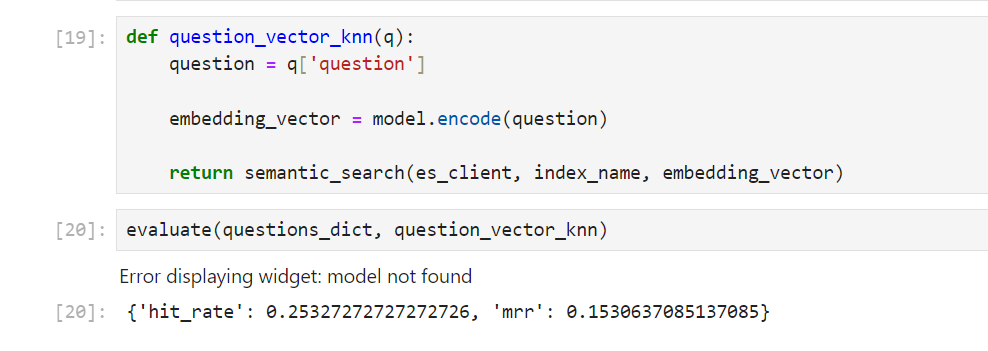

## 📂 **Evaluation**

This folder contains all the notebooks and resources used to evaluate the **Retrieval-Augmented Generation (RAG)** system using two primary metrics: **Hit Rate** and **MMR (Mean Reciprocal Rank)**.

#### **Evaluation Metrics:**

- **Hit Rate**: Measures the percentage of times the relevant document was retrieved in the top `k` results.
- **MMR (Mean Reciprocal Rank)**: Evaluates the ranking quality of the retrieval system by computing the reciprocal rank of the first relevant result.

### 📄 **minsearch.py**

- **Description**: Minimalistic text search engine that uses **sklearn** and **pandas**. This simple search library indexes documents with text and keyword fields, supporting filtering and boosting for search queries.
- **More Info**: For additional details, check out the [MiniSearch GitHub repository](https://github.com/alexeygrigorev/minsearch).

### 📄 **question.ipynb**

- **Description**: This notebook uses a **Large Language Model (LLM)** to **generate questions** based on the information in the dataset. These questions are saved in a **CSV** file; `questions.csv`, which is later used to evaluate the RAG system.
- **Evaluation Step**: After generating the questions, they serve as input for the RAG system to assess how well it retrieves the correct information.

### 📄 **rag_evaluation.ipynb**

- **Description**: This notebook utilizes an **LLM as a judge** to evaluate the quality of responses generated by the RAG system.
- **Detailed Process**:
  - After retrieving answers using the RAG pipeline, the LLM is used to **compare the system's answer with the ground truth**.
  - The LLM assigns a score based on the relevance and accuracy of the generated answer, providing a more nuanced evaluation beyond simple retrieval metrics.
- **Image**:  
  

---

### 📄 **text_retrieval.ipynb**

- **Description**: This notebook calculates the **Hit Rate** and **MMR score** for retrieval using both the **MiniSearch** and **ElasticSearch** systems, focusing on **keyword-based search**.
- **Evaluation**: The comparison between the two retrieval systems helps determine which approach performs better for keyword search in the RAG pipeline.

- **Image**:  
  

### 📄 **semantic.ipynb**

- **Description**: This notebook calculates the **Hit Rate** and **MMR score** for retrieval using **ElasticSearch** with **semantic search**. Additionally, it evaluates **hybrid search** combining keyword search and semantic search using **LangChain**.
- **Evaluation**: The results from semantic search and hybrid search are compared to keyword search to determine the most effective retrieval method for the app.

- **Image**:
  - **For the semantic search**
    
  - **For the hybrid search**
    

By comparing the different retrieval strategies across **keyword**, **semantic**, and **hybrid** searches, we select the best-performing method to power the app’s information retrieval system.

#### Based on the results, semantic search performed better with a hit rate of 0.2533 and MMR of 0.1531, and will be integrated into our final application.
